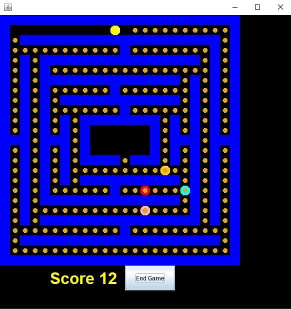

# cmsc389T-winter22

# Project 1: Pacman - Team 9’s Readme

###      Ambika Sikri, Christopher Hasbani, Nila Karthikesan, Diya Thangada





### How To Run Code From Command Line(With Code Block):

1. Pull the code from the repository to ensure you are up to date.
2. (assuming there were changes from the last compile) run the java compiler passing “src/” to the -cp flag and compiling every .java file in the src folder.
3. run the StartMenu class with the java command and pass “src/” to the -cp flag and StartMenu which will open the menu and hit the start game button to begin


Run the following code from the ```Team9/Projects/P1``` directory:
```
git pull
javac -cp "src/" src/*.java
java -cp "src/" StartMenu
```

### Running Tests From Command Line (With Code Block):
1. If code has not been recently pulled from the main repository, run ```git pull``` to ensure all code is up to date.
2. (assuming there were changes from the last compile) run the java compiler by passing the path for the Junit test files to the -cp flag and compiling every .java file (the files containing implemented functions and the files containing implemented Junit tests corresponding to implemented functions)
3. Run the java file containing the JUnit test for the function you are testing by passing the path to the JUnit test files to the -cp flag along with the ```org.junit.runner.JUnitCore``` command to run a Junit test followed by the name of the compiled Junit test file you wish to run (for example ```TestPacmanInRange```)


Run the following code from the ```Team9/Projects/P1``` directory:
```
git pull
javac -cp "tests/junit-4.10.jar:src/:tests/" src/*.java tests/*.java
java -cp "tests/junit-4.10.jar:src/:tests/" org.junit.runner.JUnitCore TestPacmanInRange
```

For Windows users, the last two functions differ (all colons are replaced with semi-colons) like so:
```
javac -cp "tests/junit-4.10.jar;src/;tests/" src/*.java tests/*.java
java -cp "tests/junit-4.10.jar;src/;tests/" org.junit.runner.JUnitCore TestPacmanInRange
```
# Function Implementation
***
### Ambika Sikri
***
**PacMan: `get_valid_moves()`**
* Implementation:
    * Checked locations upwards, downwards, left, and right (by 1 unit from PacMan’s current location) for the presence of WALL or null space. If the location was not occupied by a wall or was not null, this location was considered valid and was added to an `ArrayList<Location>` that contains all valid locations the PacMan can move to from it’s current location.

* Test:
    * Create and starts game with PacMan, Ghost, and Cookies. Compares and  asserts true if the list of valid moves returned by the function contains a PacMan’s viable new location.

**Ghost: `get_valid_moves()`**
* Implementation:
    * Checked locations upwards, downwards, left, and right (by 1 unit from Ghost’s current location) for the presence of WALL or null space. If the location was not occupied by a wall or was not null, this location was considered valid and was added to an `ArrayList<Location>` that contains all the valid locations the Ghost can move to from its current location.

* Test:
    * Create and starts game with PacMan, Ghost, and Cookies. Compares and asserts true if the list of valid moves returned by the function contains a ghost’s viable new location.

**Map: `move()`:**
* Implementation:
    * Move the PacMan or Ghost (component passed in) by updating the component’s location and removing them from the `Map(field)`. Returning true upon successfully moving the PacMan, false otherwise.

* Test:
    * Create and starts game with PacMan, Ghosts, and Cookies. Test moving PacMan to viable location and assert true if the function returns true. Test by attempting to move PacMan to an invalid location (occupied by WALL), assert false if this function returns true.

### Christopher Hasbani
***
**Pacman: `consume()`**
* Implementation:
    * Checked if there is a Cookie in the hashset that corresponds to our current location in the map’s field, then returned the call to map’s `eatcookie()` function otherwise returned null.

* Test:
    *Created a noframe board then added a pacman to (1,1) which has a cookie then checked if the consume method returned a non-null component.

**Ghost: `attack()`**
* Implementation:
    * Called `is_pacman_in_range()` to verify there is a pacman in the range and calls 'map.attack()' if true else returns false.

* Test:
    * Created a noframe board then added a pacman to (1,1) then two ghosts. One is at (1,2) the other (1,6) and checked if the first one’s attack returned true and the second one false.

**Map: `attack()`**
* Implementation:
    * We already verify a pacman is in range of the ghost to call this method so within we just set gameover to true and return true.

* Test:
    * Created a noframe board then added a packman to (1,1) then two ghosts. One is at (1,2) the other (1,6) and checked if the first one’s attack makes the frame’s gameover variable true.

### Nila Karthikesan
***
**PacMan: `moves()`**
* Implementation:
    * Checked if get_valid_moves is empty and returns false if it is. If get_valid_moves is not empty then returns true and sets the location of pacman to the first location in the set returned by get_valid_moves.

* Test:
    * To test this function I created a pacman object at a certain location using addpacman. Then I used `assertfalse` and checked if at that location there was a pacman object.

**Ghost:`moves()`**
* Implementation:
    * Checked if get_valid_moves is empty and returns false if it is. If get_valid_moves is not empty then returns true and sets the location of pacman to the first location in the set returned by get_valid_moves.

* Test:
    * To test this function I created a pacman object at a certain location using addpacman. Then I used `assertfalse` and checked if at that location there was a pacman object.

**Map: `getLoc()`**
* Implementation:
    * I used the `.get()` function to get the object that is at the location of loc. The object is saved to the variable returnValue. The function then returns this object.

* Test:
    * To test this function I created a pacman object at a certain location  using addpacman. Then I used assertfalse and checked if at that location there was a pacman object.


### Diya Thangada
***
**Map Class: eatCookie method**

* Format: `public JComponent eatCookie(String name)`
    * For the eatCookie, I implemented this method by checking if there’s a cookie at the named (given by the String) item’s location (utilizing the locations aspect of Map class), and if not return null (also return null no cookie eaten). If it does exist, then update locations, components, and field by removing the cookie, incrementing cookies, and utilizing the components aspect of Map to return the JComponent.

* TestMapEatCookie:
    * My test sets up the frame, and adds a pacman and ghost, then calls eatCookie and makes sure it returns null (there should be no cookie). Then, I add a cookie, and make sure a JComponent is being returned and that null is not returned (there should be a cookie to eat).

**Ghost Class: is_pacman_in_range method**

* Format: `public boolean is_pacman_in_range()`
    * For is_pacman_in_range, I made locations for the 1 block radius around the ghost, then checked if when I call getLoc on each location in the radius if I receive a not-null set that contains Pacman. If so, then return true (it is in the radius/range). If not, then return false.

* TestGhostInRange
    * I used this test to test the is_pacman_in_range method of the Ghost class. I made ghosts and pacmen at the different locations in the radius, and if is_pacman_in_range returns true, then the test asserts true. I also checked if pacman is not in range, then is_pacman_in_range should return false and the test asserts false.

**PacMan Class: is_ghost_in_range method**

* Format: `public boolean is_ghost_in_range()`
    * For is_ghost_in_range, I made locations for the 1 block radius around the Pacman, then checked if when I call getLoc on each location in the radius if I receive a not-null set that contains a ghost. If so, then return true (it is in the radius/range). If not, then return false.

* TestPacmanInRange
    * I used this test to test the is_ghost_in_range method of the PacMan class. I made pacman and ghosts at the different locations in the radius, and if is_ghost_in_range returns true, then the test asserts true. I also checked if ghost is not in range, then is_ghost_in_range should return false and the test asserts false.
